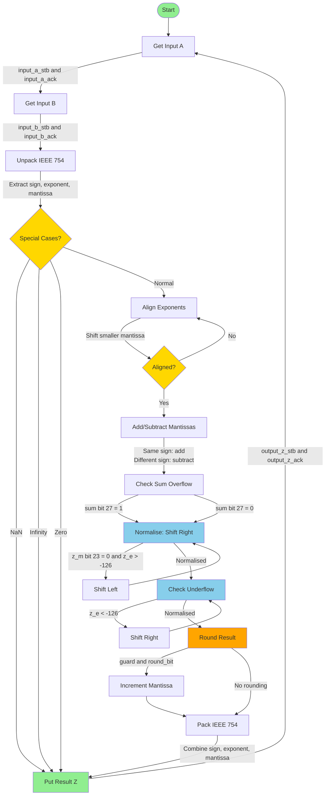
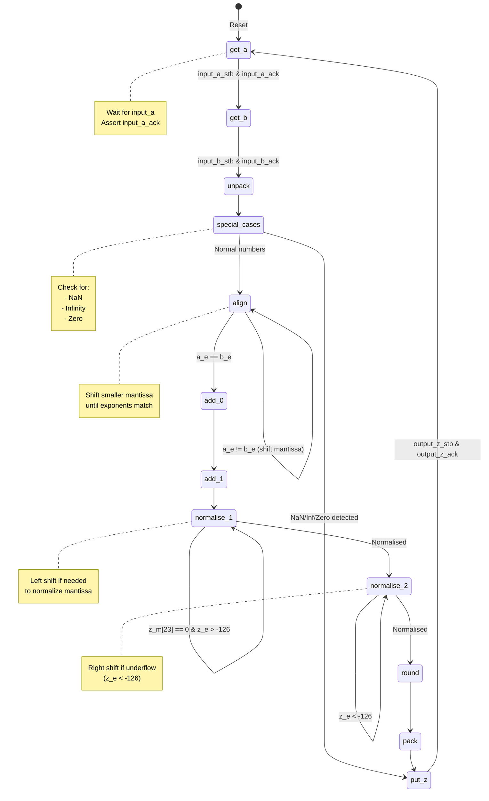

# Adder Block Diagram

## Adder Implementation Details

### Inputs/Outputs
- **Inputs**: `input_a[31:0]`, `input_b[31:0]` (IEEE 754 single precision)
- **Handshake**: `input_a_stb`, `input_b_stb`, `input_a_ack`, `input_b_ack`
- **Output**: `output_z[31:0]` (IEEE 754 single precision)
- **Handshake**: `output_z_stb`, `output_z_ack`

### Key Processing Stages
1. **Unpack**: Extracts sign (bit 31), exponent (bits 30:23), mantissa (bits 22:0)
2. **Special Cases**: Handles NaN, Infinity, Zero cases
3. **Align**: Aligns mantissas by shifting the smaller exponent
4. **Add/Subtract**: Performs mantissa addition or subtraction based on signs
5. **Normalise**: Normalizes result to IEEE 754 format
6. **Round**: Applies rounding based on guard, round_bit, and sticky bits
7. **Pack**: Combines sign, exponent, and mantissa into final result

## Adder FSM State Diagram

