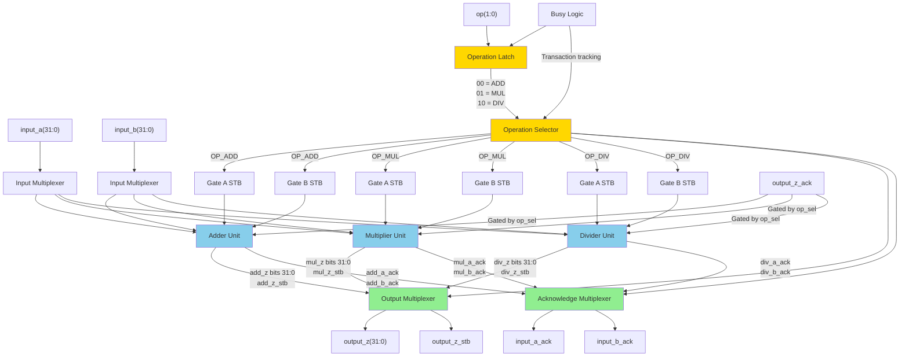
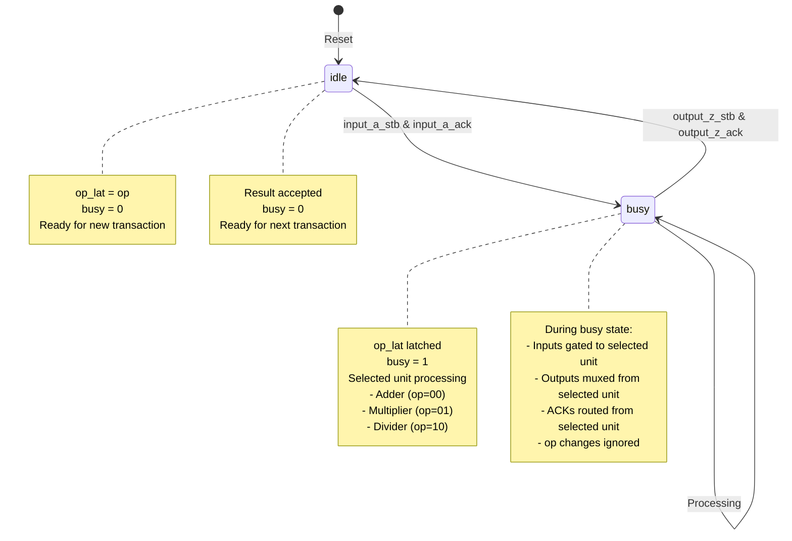

# FPU Top Unit Block Diagram

## FPU Top Unit Implementation Details

### Inputs/Outputs
- **Operation Select**: `op[1:0]`
  - `2'b00` = ADD
  - `2'b01` = MUL
  - `2'b10` = DIV
- **Inputs**: `input_a[31:0]`, `input_b[31:0]` (IEEE 754 single precision)
- **Handshake**: `input_a_stb`, `input_b_stb`, `input_a_ack`, `input_b_ack`
- **Output**: `output_z[31:0]` (IEEE 754 single precision)
- **Handshake**: `output_z_stb`, `output_z_ack`

### Key Components
1. **Operation Latch**: Latches the operation code when transaction starts
2. **Operation Selector**: Selects which FPU unit to activate based on `op`
3. **Input Gating**: Gates input strobes (`input_a_stb`, `input_b_stb`) to selected unit only
4. **Output Multiplexer**: Routes output from selected unit to `output_z`
5. **Acknowledge Multiplexer**: Routes acknowledgements from selected unit
6. **Busy Logic**: Tracks transaction state (from A accepted to Z accepted)
   - Prevents operation change during active transaction
   - Ensures proper handshaking

### Transaction Flow
1. `op` must be stable when `input_a_stb` is asserted
2. Operation is latched when `input_a` is accepted
3. Selected unit processes the operation
4. Result is routed through output multiplexer
5. Busy flag clears when result is accepted

## FPU Top Unit State Tracking

