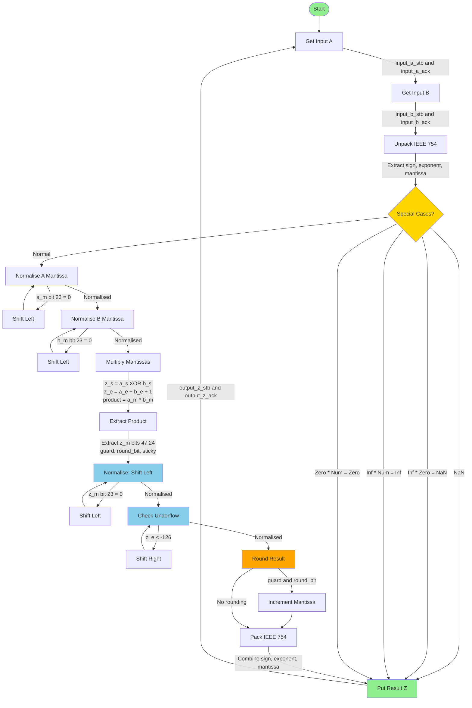
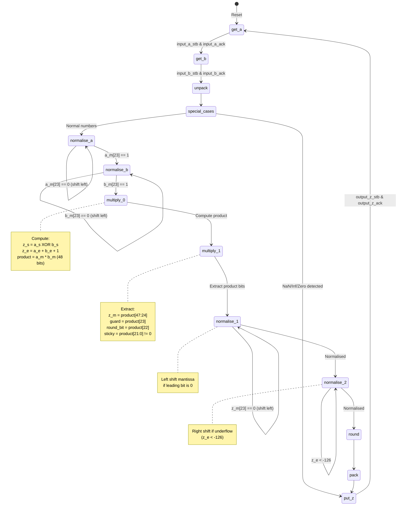

# Multiplier Block Diagram

## Multiplier Implementation Details

### Inputs/Outputs
- **Inputs**: `input_a[31:0]`, `input_b[31:0]` (IEEE 754 single precision)
- **Handshake**: `input_a_stb`, `input_b_stb`, `input_a_ack`, `input_b_ack`
- **Output**: `output_z[31:0]` (IEEE 754 single precision)
- **Handshake**: `output_z_stb`, `output_z_ack`

### Key Processing Stages
1. **Unpack**: Extracts sign, exponent, mantissa from IEEE 754 format
2. **Special Cases**: Handles NaN, Infinity, Zero multiplication cases
3. **Normalise A/B**: Normalizes both mantissas to ensure leading 1
4. **Multiply**: Performs 24-bit × 24-bit multiplication (produces 48-bit product)
   - Sign: XOR of input signs
   - Exponent: Sum of exponents + 1
   - Mantissa: Product of mantissas
5. **Normalise**: Normalizes product to IEEE 754 format
6. **Round**: Applies rounding based on guard, round_bit, and sticky bits
7. **Pack**: Combines sign, exponent, and mantissa into final result

## Multiplier FSM State Diagram

