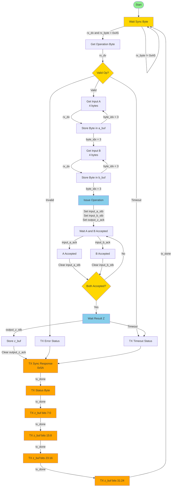
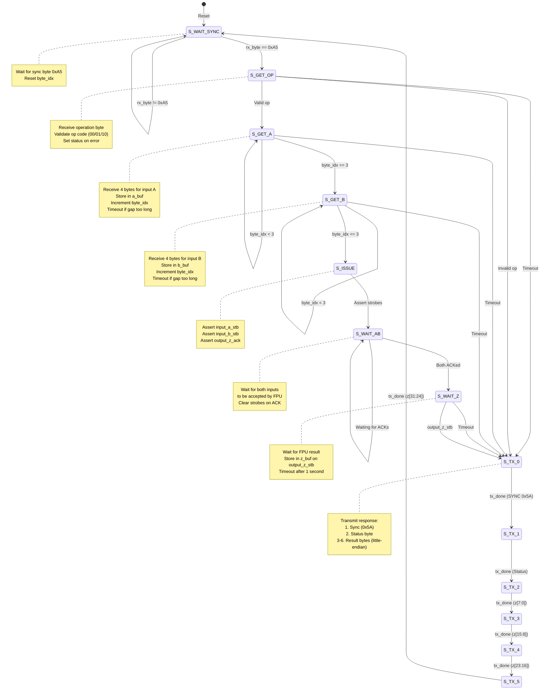

# UART Bridge Block Diagram

## UART Bridge Implementation Details

### Protocol Format
**Request Packet** (9 bytes):
1. Sync byte: `0xA5`
2. Operation byte: `op[1:0]` (bits 1:0), upper bits must be 0
3. Input A: 4 bytes (little-endian)
4. Input B: 4 bytes (little-endian)

**Response Packet** (6 bytes):
1. Sync byte: `0x5A`
2. Status byte: `0x00` (OK), `0x01` (BAD_SYNC), `0x02` (BAD_OP), `0x10` (TIMEOUT)
3. Result Z: 4 bytes (little-endian)

### Inputs/Outputs
- **UART RX**: `rx_dv`, `rx_byte[7:0]`
- **UART TX**: `tx_dv`, `tx_byte[7:0]`, `tx_active`, `tx_done`
- **FPU Interface**:
  - `op[1:0]`, `input_a[31:0]`, `input_b[31:0]`
  - `input_a_stb`, `input_b_stb`, `input_a_ack`, `input_b_ack`
  - `output_z[31:0]`, `output_z_stb`, `output_z_ack`

### Key States
1. **S_WAIT_SYNC**: Waits for sync byte `0xA5`
2. **S_GET_OP**: Receives operation byte (validates op code)
3. **S_GET_A**: Receives 4 bytes for input A
4. **S_GET_B**: Receives 4 bytes for input B
5. **S_ISSUE**: Issues operation to FPU (asserts strobes)
6. **S_WAIT_AB**: Waits for FPU to accept inputs A and B
7. **S_WAIT_Z**: Waits for FPU result (with timeout)
8. **S_TX_0 to S_TX_5**: Transmits response packet (6 bytes)

### Timeout Handling
- **RX Timeout**: `RX_TIMEOUT_CYCLES` (~40ms @50MHz) - timeout between bytes
- **Z Timeout**: `Z_TIMEOUT_CYCLES` (~1s @50MHz) - timeout waiting for result

### Error Handling
- **BAD_SYNC**: Invalid sync byte received
- **BAD_OP**: Invalid operation code (not 00, 01, or 10)
- **TIMEOUT**: Timeout during byte reception or result waiting

## UART Bridge FSM State Diagram

